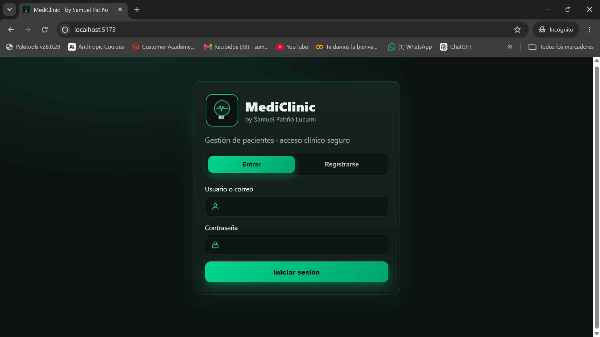
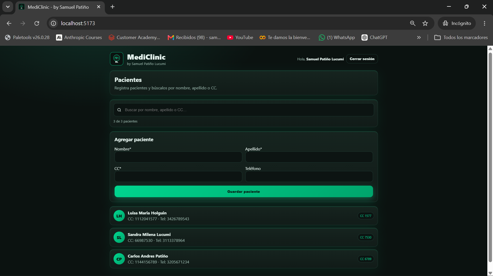
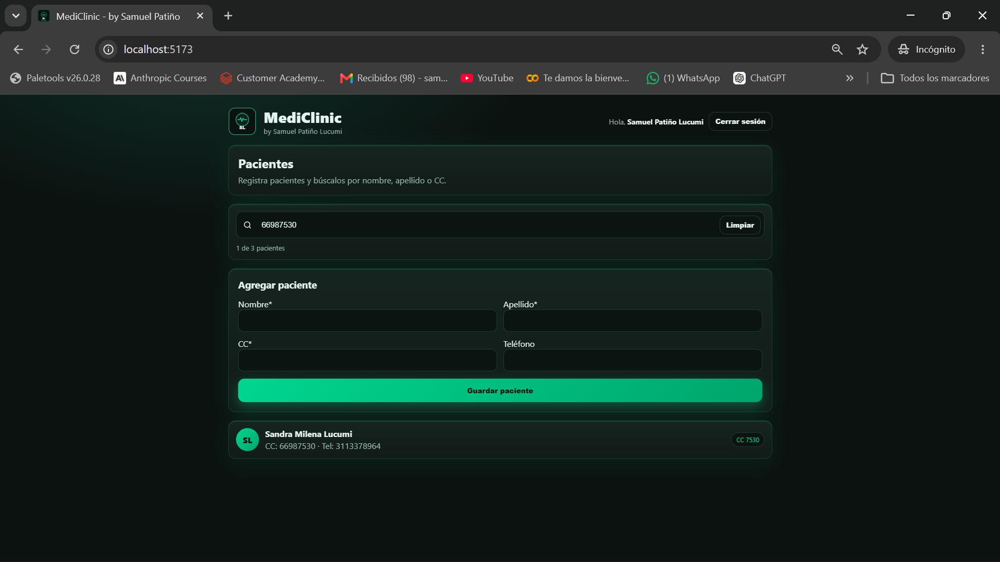
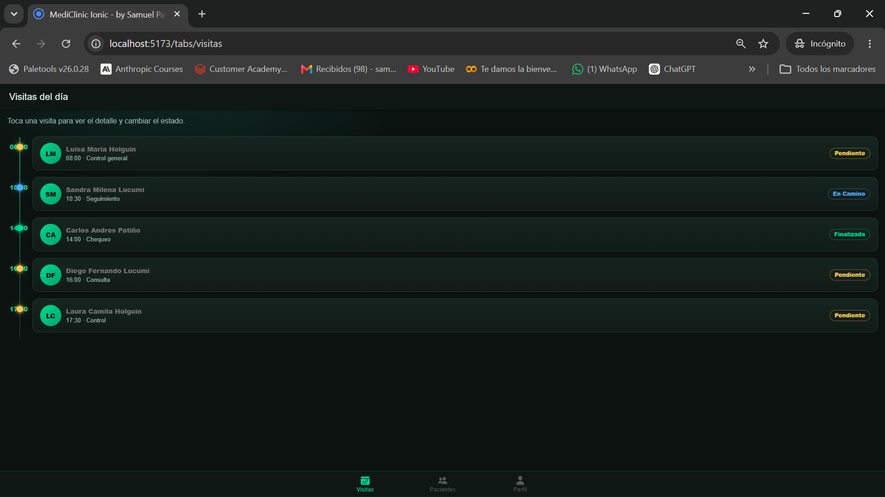
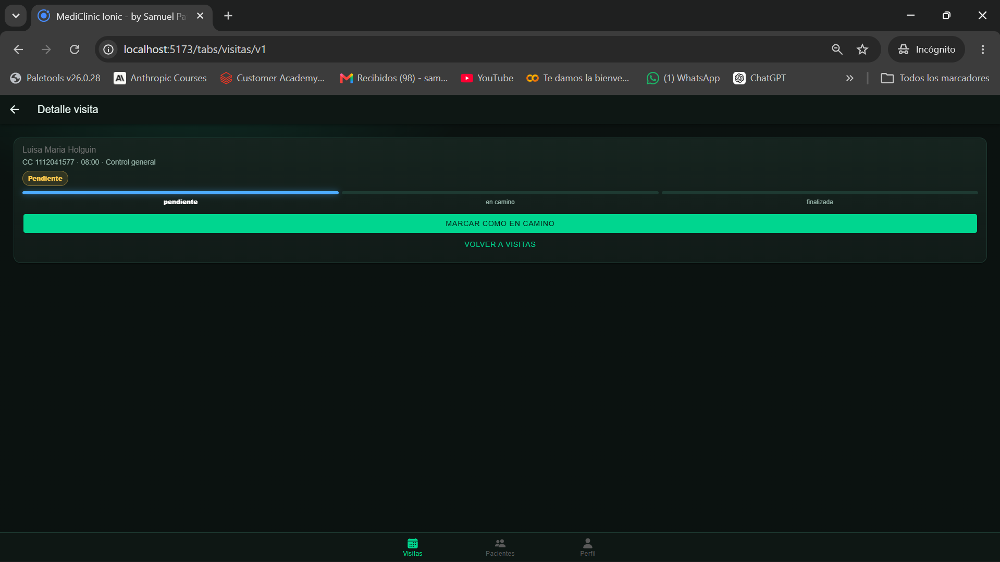
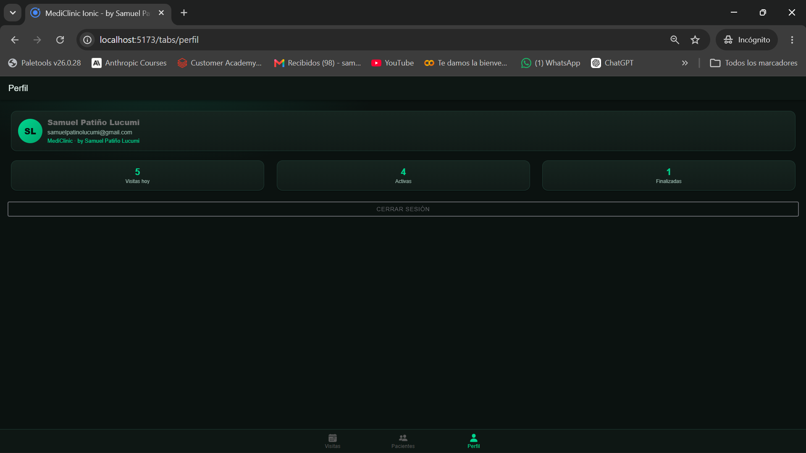

# Parcial 1 - MediClinic

Hice dos apps para la clínica MediClinic, las dos guardan todo en `localStorage` (sin backend).

## Qué hay aquí

- `pwa/` → App web con PWA para administrar pacientes.
- `ionic/` → App móvil con Ionic para que el médico vea sus visitas.

## PWA - Pacientes

Login, lista de pacientes, formulario para agregar y buscador por nombre, apellido o CC.

Para correrla:

```bash
cd pwa
npm install
npm run dev
```

Para probarla pueden usar este usuario:

- Usuario: `Slucu_0310` (o el correo `samuelpatinolucumi@gmail.com`)
- Clave: `Patino032004`

También se pueden registrar con uno nuevo si quieren.

## Ionic - Visitas

Login con Ionic, tabs de Visitas / Pacientes / Perfil. En visitas se ve la lista del día y al darle clic se puede cambiar el estado: pendiente → en camino → finalizada.

Para correrla:

```bash
cd ionic
npm install
npm run dev
```

Se entra con el mismo usuario de arriba.

## Capturas

Unas fotos de cómo se ve funcionando.

### PWA

Login y lista de pacientes con el formulario:




Buscador filtrando por CC:



### Ionic

Visitas del día y detalle con cambio de estado:




Perfil:



## Notas

- No comparten datos entre ellas, cada una tiene su propio `localStorage`.
- La PWA ya genera su service worker cuando se hace `npm run build`.
- En Ionic tuve que pasar el router a la versión 6 (`element`, `Navigate`, `useNavigate`) para que compilara.
